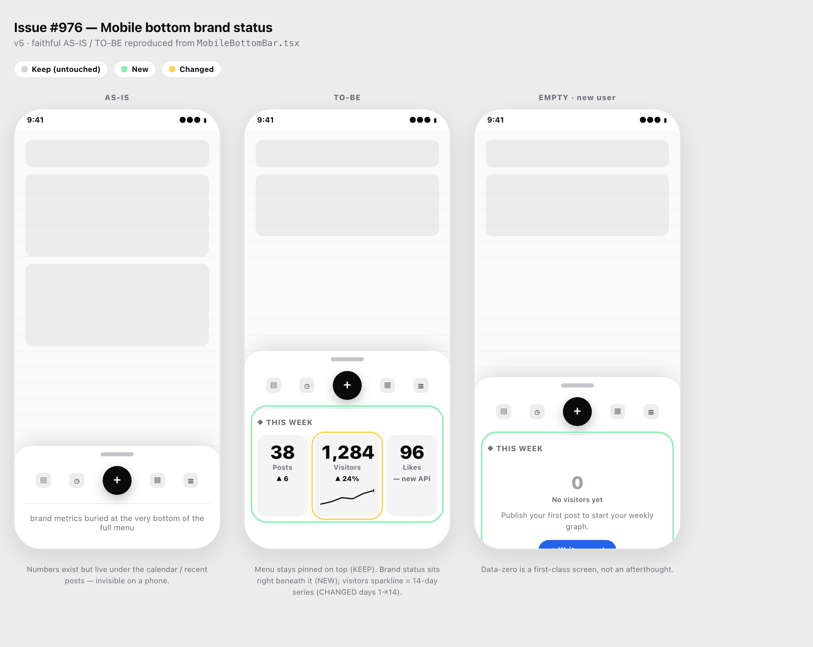

# Examples

Concrete artifacts produced by the **design-from-code** skill.

## `mobile-bottom-brand-status-v5.html`

The final (v5) deliverable for issue #976 — "add a brand-status card to the mobile bottom bar." Open it in any browser; it is fully self-contained (inline CSS + inline SVG, zero dependencies).

It shows three phones side by side, which is exactly how the skill presents a UI change:

- **AS-IS** — the current bar, reproduced from the real `MobileBottomBar.tsx` (metrics buried at the bottom of the full menu).
- **TO-BE** — the proposal. The nav bar stays pinned on top (**keep**), the brand-status card sits directly beneath it (**new**, green outline), and the visitors tile gets a 14-day sparkline (**changed**, yellow outline).
- **EMPTY · new user** — the data-zero state, treated as a first-class screen with a clear call to action.

### Rendered preview



### Regenerate the screenshot

```bash
cd examples
python3 -m http.server 8777 &
"/Applications/Google Chrome.app/Contents/MacOS/Google Chrome" \
  --headless=new --disable-gpu --hide-scrollbars --force-device-scale-factor=2 \
  --window-size=1180,940 \
  --screenshot="images/mobile-bottom-brand-status-v5.png" \
  "http://localhost:8777/mobile-bottom-brand-status-v5.html"
kill %1
```

> `file://` URLs are blocked by most headless setups, so serve over a local HTTP server first.

For the full step-by-step story behind this mockup (v1→v5, including the user correction), see [`../skills/design-from-code/examples/issue-976-walkthrough.md`](../skills/design-from-code/examples/issue-976-walkthrough.md).
